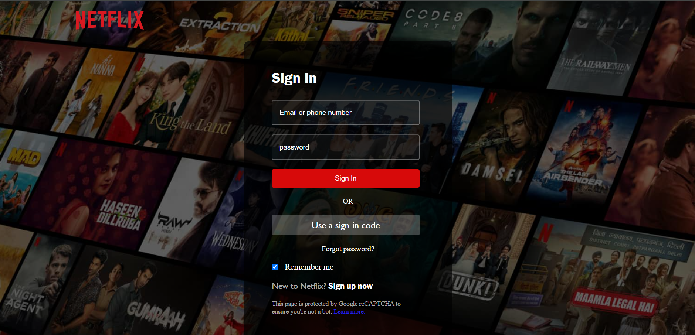

# Netflix Clone with React.js

This project is a Netflix clone developed using React.js. It replicates the user interface of the popular streaming platform Netflix.

## Features

- **Responsive Design:** The application is designed to be responsive, providing an optimal viewing experience across a wide range of devices.
- **Movie & TV Show Categories:** Users can explore different categories such as Trending, Top Rated, Action, Comedy, etc.
- **Search Functionality:** The search feature enables users to search for specific movies or TV shows by title.
- **Trailer Playback:** Clicking on a movie or TV show card opens a modal with a trailer playback option.

## Technologies Used

- **React.js:** The project is built using the React.js library, allowing for efficient component-based development.
- **React Router:** React Router is used for navigation within the application, enabling seamless transitions between different pages.
- **Axios:** Axios is utilized for making HTTP requests to the TMDB API to fetch movie and TV show data.
- **CSS:** Custom CSS styles are applied to enhance the visual appearance and layout of the application.

## Setup Instructions

1. **Clone the Repository:** Use `git clone` to clone the repository to your local machine.
2. **Install Dependencies:** Run `npm install` to install the necessary dependencies.
   <<<<<<< HEAD
3. **Start the Development Server:** Run `npm start` to start the development server and view the project in your browser.

## Screenshots

## Future Improvements

- Implement user authentication and user-specific recommendations.
- Add additional features such as saving favorites and creating watchlists.
- Enhance UI/UX with animations and transitions.
=======
# Netflix Clone with React.js

This project is a Netflix clone developed using React.js. It replicates the user interface of the popular streaming platform Netflix.

## Features

- **Responsive Design:** The application is designed to be responsive, providing an optimal viewing experience across a wide range of devices.
- **Movie & TV Show Categories:** Users can explore different categories such as Trending, Top Rated, Action, Comedy, etc.
- **Search Functionality:** The search feature enables users to search for specific movies or TV shows by title.
- **Trailer Playback:** Clicking on a movie or TV show card opens a modal with a trailer playback option.

## Technologies Used

- **React.js:** The project is built using the React.js library, allowing for efficient component-based development.
- **React Router:** React Router is used for navigation within the application, enabling seamless transitions between different pages.
- **Axios:** Axios is utilized for making HTTP requests to the TMDB API to fetch movie and TV show data.
- **CSS:** Custom CSS styles are applied to enhance the visual appearance and layout of the application.

## Setup Instructions

1. **Clone the Repository:** Use `git clone` to clone the repository to your local machine.
2. **Install Dependencies:** Run `npm install` to install the necessary dependencies.
   <<<<<<< HEAD
3. **Start the Development Server:** Run `npm start` to start the development server and view the project in your browser.

## Screenshots
## Homepage:

## Login Page:

## Future Improvements

- Implement user authentication and user-specific recommendations.
- Add additional features such as saving favorites and creating watchlists.
- Enhance UI/UX with animations and transitions.
>>>>>>> aa0d5c05f7ed085dff87ac58ef25c8877e5d5f2d
